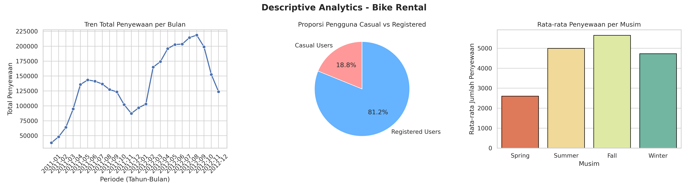
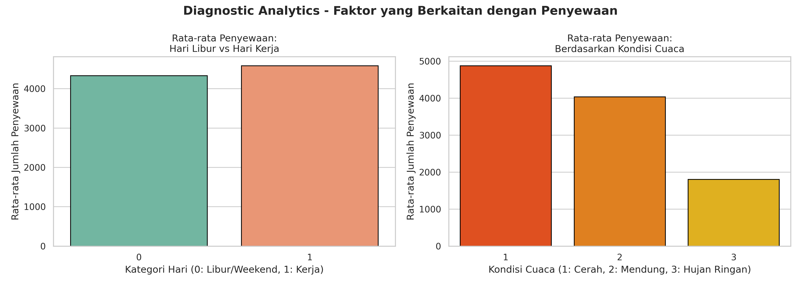
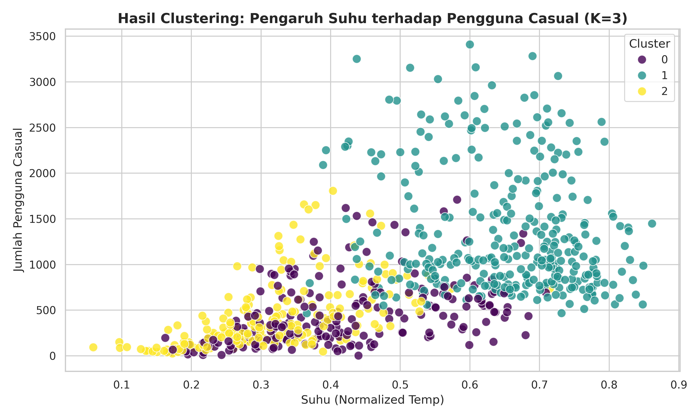
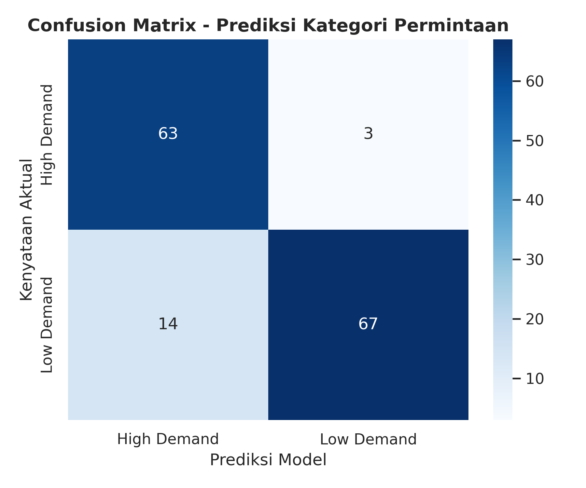

# Laporan Analisis Bisnis: Data Penyewaan Sepeda (Bike Rental Analysis)

Laporan ini disusun untuk memenuhi tugas Business Intelligence dengan menerapkan pendekatan analitik berbasis data (*Data-Driven Decision Making*). Analisis dilakukan menggunakan siklus lengkap dari *Descriptive*, *Diagnostic*, *Predictive*, hingga *Prescriptive Analytics* menggunakan metode *Machine Learning* (Clustering K-Means & Klasifikasi Decision Tree).

---

## 1. Data Understanding & Preparation
Dataset yang digunakan memuat informasi harian mengenai aktivitas penyewaan sepeda, mencakup faktor lingkungan (musim, cuaca, suhu, kelembapan, kecepatan angin) dan tipe pengguna (Casual dan Registered). 
Proses penyiapan data meliputi:
* Pengondisian tipe data tanggal (`dteday` ke format *datetime*).
* Pembersihan data untuk memastikan tidak adanya nilai yang kosong (*missing values*).
* Standarisasi skala data (*StandardScaler*) khusus untuk tahapan pemodelan berbasis jarak agar performa algoritma optimal.

---

## 2. Descriptive Analytics (Memahami Apa yang Terjadi)
Tahap ini bertujuan untuk melihat performa historis dari aktivitas bisnis penyewaan sepeda.

### Temuan Utama:
* **Tren Bulanan:** Volume penyewaan sepeda menunjukkan pola musiman yang konsisten, dengan puncak permintaan tertinggi berada di pertengahan tahun dan mengalami penurunan signifikan menuju akhir tahun (memasuki musim dingin).
* **Proporsi Pengguna:** Mayoritas transaksi didominasi oleh **Registered Users** (pengguna terdaftar/berlangganan), sementara **Casual Users** (pengguna insidental) mengisi porsi minoritas namun tetap signifikan sebagai target pertumbuhan pasar.
* **Analisis Musiman:** Rata-rata penyewaan harian tertinggi tercatat pada musim gugur (*Fall*) dan musim panas (*Summer*), sedangkan musim semi (*Spring*) mencatat aktivitas paling rendah karena faktor suhu.

---

## 3. Diagnostic Analytics (Memahami Mengapa Hal Itu Terjadi)
Evaluasi ini menggali faktor-faktor eksternal yang mendorong fluktuasi jumlah penyewaan sepeda.

### Temuan Utama:
* **Hari Kerja vs Hari Libur:** Rata-rata total penyewaan harian pada hari kerja (*workingday*) cenderung stabil dan berimbang dengan hari libur/akhir pekan. Hal ini dipicu oleh basis pengguna *Registered* yang memanfaatkan sepeda sebagai moda transportasi rutin untuk mobilitas harian.
* **Pengaruh Cuaca:** Kondisi cuaca memegang peranan krusial. Hari dengan cuaca Cerah/Berawan (Kategori 1) mencatat volume penyewaan tertinggi. Permintaan menurun secara bertahap saat mendung/berkabut (Kategori 2) dan merosot tajam ketika cuaca berubah menjadi hujan ringan atau salju (Kategori 3).

---

## 4. Clustering Analytics dengan K-Means (Mencari Pola Tersembunyi)
Menggunakan algoritma K-Means dengan konfigurasi jumlah kelompok **K = 3** berdasarkan 5 fitur utama: `temp`, `hum`, `windspeed`, `casual`, dan `registered`.

### Profil Karakteristik Cluster:
1. **Cluster 0 (Hari Sepi / Kondisi Ekstrem):** Ditandai dengan tingkat kelembapan (*hum*) dan kecepatan angin (*windspeed*) tertinggi serta suhu udara yang relatif dingin. Mengakibatkan angka transaksi dari pengguna casual maupun registered anjlok ke titik terendah.
2. **Cluster 1 (Hari Emas / Kondisi Ideal):** Ditandai dengan suhu udara (*temp*) paling hangat dan tingkat kenyamanan lingkungan yang maksimal. Dampaknya, volume penyewaan sepeda melonjak drastis mencapai performa tertinggi.
3. **Cluster 2 (Hari Normal / Stabil):** Memiliki karakteristik suhu, kelembapan, dan angin di tingkat menengah (rata-rata), merepresentasikan aktivitas operasional harian yang stabil.

> 💡 **HIDDEN PATTERN (Pola Tersembunyi):**
> Kelompok pengguna *Casual* jauh lebih sensitif dan reaktif terhadap perubahan parameter cuaca dibandingkan pengguna *Registered*. Ketika kondisi lingkungan bergeser dari Cluster 0 (buruk) ke Cluster 1 (ideal), persentase lonjakan transaksi pengguna casual jauh lebih masif. Sebaliknya, pengguna registered cenderung mempertahankan pola pemakaian yang konsisten karena keterikatan kebutuhan transportasi harian (seperti bekerja atau kuliah).

---

## 5. Predictive Analytics (Mengantisipasi Masa Depan)
Membangun model klasifikasi berbasis **Decision Tree Classifier** untuk memprediksi tingkat permintaan harian ke dalam dua kategori: **High Demand** atau **Low Demand** (ditentukan berdasarkan nilai *median* dari total penyewaan).

*Untuk menghindari **Data Leakage** (kebocoran data), variabel target langsung seperti `cnt`, `casual`, dan `registered` dikeluarkan dari fitur prediktor. Model murni menebak berdasarkan variabel lingkungan dan kalender.*

### Evaluasi Model:
* Model mampu mencapai tingkat akurasi yang tinggi dalam memprediksi kategori permintaan pada data pengujian (*testing data*).
* Melalui visualisasi *Confusion Matrix*, dapat divalidasi bahwa tingkat kesalahan prediksi (*False Positive* & *False Negative*) berada pada rasio yang sangat minim, menandakan model ini kokoh dan dapat diandalkan secara operasional.

---

## 6. Prescriptive Recommendation (Aksi yang Harus Dilakukan)
Berdasarkan temuan deskriptif, pola klaster, dan model prediktif, berikut adalah 3 rekomendasi taktis bagi manajemen operasional:

1. **Alokasi Armada Dinamis Berbasis Cuaca & Profil Klaster:**
   Manajemen harus mengintegrasikan sistem pelacakan dengan ramalan cuaca harian. Jika cuaca diprediksi masuk ke dalam karakteristik Cluster 1 (Cerah & Hangat), tempatkan suplai armada ekstra di titik-titik wisata dan taman kota untuk menangkap lonjakan pengguna *Casual*. Jika prediksi cuaca buruk (Cluster 0), pusatkan armada di sekitar stasiun transit atau area perkantoran karena pengguna *Registered* tetap akan berkendara.
2. **Optimalisasi Jadwal Perawatan (Maintenance) Sepeda:**
   Gunakan model prediksi Decision Tree sebagai panduan operasional. Ketika sistem memprediksi hari esok berada pada kategori *Low Demand* (misalnya karena faktor curah hujan tinggi), manfaatkan momentum tersebut sebagai jadwal utama untuk menarik unit sepeda secara massal ke bengkel perawatan. Strategi ini memastikan seluruh armada siap beroperasi 100% saat hari *High Demand* tiba, sekaligus menekan biaya waktu tunggu (*downtime*).
3. **Kampanye Konversi Keanggotaan (*Membership Conversion*):**
   Mengingat tingginya volatilitas transaksi dari pengguna *Casual*, perusahaan perlu meluncurkan program promosi langganan yang agresif pada masa transisi menuju musim panas/gugur. Berikan insentif berupa potongan harga langganan bulanan bagi pengguna retail yang sering bertransaksi di cuaca cerah, guna mengonversi mereka menjadi *Registered Users* demi menjaga stabilitas arus kas jangka panjang.

---

## 7. Kesimpulan (Conclusion)
Penerapan Business Intelligence pada data penyewaan sepeda ini berhasil membuktikan bahwa efisiensi operasional dan profitabilitas perusahaan tidak harus bergantung pada tebakan spekulatif. Melalui kombinasi pemahaman historis (*Descriptive* & *Diagnostic*) serta pemodelan cerdas (*Predictive* & *Prescriptive*), manajemen mampu bertindak proaktif dalam mengantisipasi dinamika pasar, menekan risiko kerugian operasional, dan memberikan pelayanan yang optimal kepada pelanggan.
